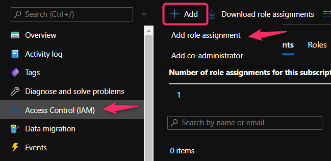

## Required env variables

```
ACCOUNT_NAME=<account name>
AZURE_TENANT_ID=<tenant id>
AZURE_CLIENT_ID=<client id>
AZURE_CLIENT_SECRET=<client secret>
```

## Add role to your app service princiapl


